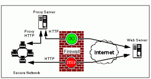

I work in a high school and a middle school, which means I have to prevent students from browsing non‑educational websites…

For a while now, “Tor Browser” has been around.

How it works:
- It doesn’t require admin rights to run.
- At startup, Tor asks whether your network uses a proxy. If you answer “no”, it tries to contact Tor IPs through the default gateway and scans for any ports that can reach the Internet.

A first layer of protection is therefore to prevent clients from going directly to the Internet and to enforce a proxy. Only the proxy is allowed outbound access. Tor will scan and never find an exit.

But Tor can also work through a proxy (if configured). The principle is:
Tor contacts a Tor IP through the proxy and keeps the connection open, then tunnels Tor traffic through it.

So the solution is to block, in Squid (or another proxy), connections to Tor IP addresses.

Luckily, this site lists most public Tor IPs:
https://www.dan.me.uk/torlist/

I published a short tutorial on my wiki here:
https://wiki.lesfourmisduweb.org/blocktor.html
