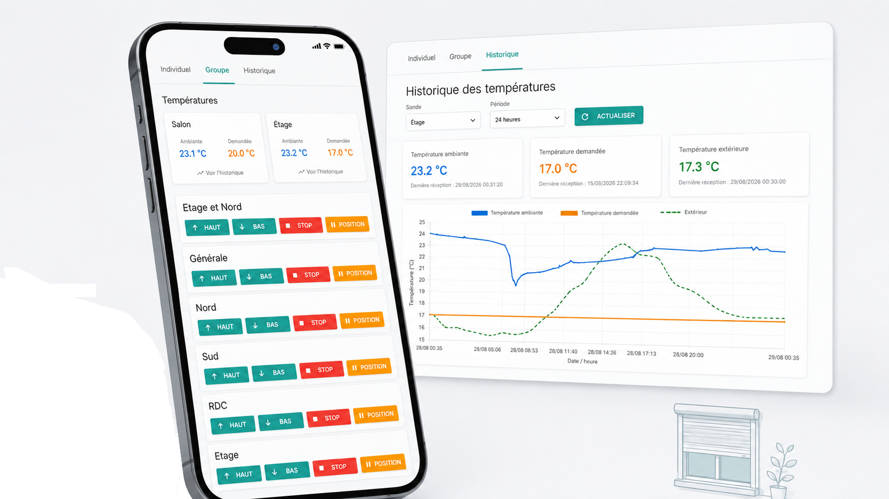

Bonjour à tous,

J’utilise un [**Devmel AirSend Duo**](https://store.devmel.com/fr/accueil/4-airsend-duo-3770005782306.html) pour piloter mes volets roulants.

Le boîtier fonctionne très bien en local, mais il ne fournit pas directement une interface web complète hébergée sur l’AirSend pour piloter ses équipements depuis un navigateur.

Devmel propose **AirSend.cloud** pour le pilotage à distance, mais fournit aussi les briques permettant de communiquer directement avec le boîtier sur le réseau local. C’est cette voie locale que j’utilise.

J’avais regardé du côté de **Home Assistant** et **Jeedom**, mais pour mon besoin je trouvais ça très lourd : beaucoup de composants, de dépendances et de configuration pour finalement faire quelque chose d’assez simple.

Moi, je voulais surtout **une page web avec quelques boutons**, accessible depuis mon téléphone.

J’ai donc fait une petite interface en Python :

[https://github.com/sfonteneau/airsend_devmel_python_simple_web_interface](https://github.com/sfonteneau/airsend_devmel_python_simple_web_interface)

Elle s’appuie sur **AirSendWebService** pour communiquer localement avec l’AirSend.

L’interface permet de piloter les volets individuellement, mais aussi de créer des **groupes**.

Par exemple, je peux ouvrir ou fermer tous les volets de la maison en une seule fois.

```text
Navigateur
    ↓
Interface web
    ↓
AirSendWebService
    ↓
AirSend Duo
    ↓
Volets
```

## Le projet a un peu grandi

J’ai découvert qu’on pouvait facilement mettre l’AirSend en **mode écoute**.

En regardant les trames reçues, je me suis aperçu que les sondes de température de ma pompe à chaleur communiquaient elles aussi en **868 MHz**.

Les données ne sont pas chiffrées, donc avec le bon récepteur on peut les lire assez facilement. Je capte d’ailleurs aussi quelques sondes de voisins, que j’ignore simplement.

J’ai donc ajouté ces températures à l’interface, avec un historique dans SQLite et une comparaison avec la température extérieure.

Au final, le projet reste volontairement léger :

**piloter mes volets, gérer des groupes et suivre quelques températures.**

Pas besoin d’une plateforme domotique complète pour ça.

Juste une petite interface web locale qui fait exactement ce dont j’ai besoin.


