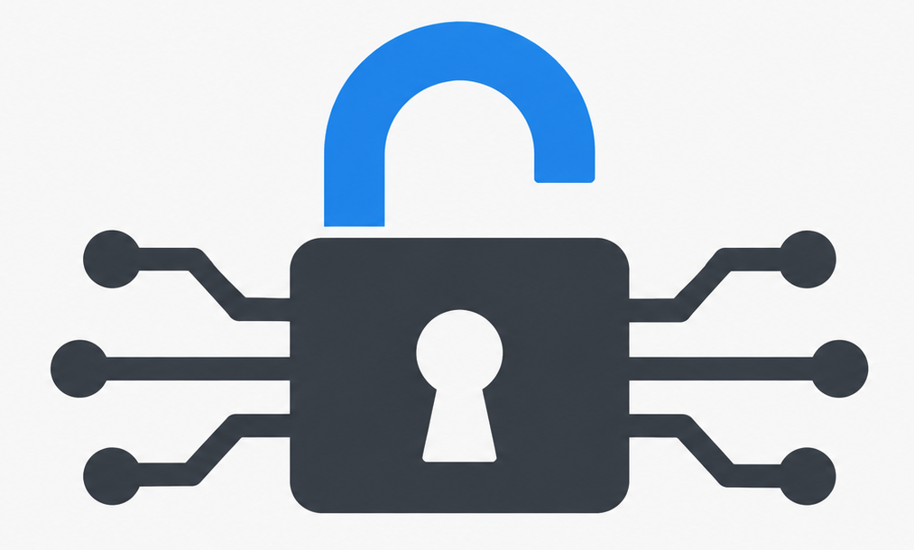

Bonjour à tous,

Dans mon [dernier article](/streaming-video-vlc-xspf-nginx/), je parlais de mon fameux serveur VLC qui tourne sur un vieux CPU à **0,8 GHz**.

Au début, je me suis vite aperçu que les **débits n'étaient pas vraiment fous**. Comme le serveur ne transcode rien, je me suis demandé ce qui pouvait bien consommer autant de CPU.

En regardant d'un peu plus près, le HTTPS est rapidement devenu suspect.

Ce vieux processeur n'a **pas d'accélération matérielle AES**. AES-GCM fonctionne très bien, mais uniquement en logiciel, et sur une machine aussi limitée ça peut vite coûter cher.

Dans ce cas, **ChaCha20-Poly1305** est souvent beaucoup plus adapté.

Un simple test permet déjà de voir la différence :

```bash
openssl speed -evp aes-128-gcm
openssl speed -evp chacha20-poly1305
```

Autre détail intéressant : nginx laisse par défaut le client influencer le choix du chiffrement avec `ssl_prefer_server_ciphers off`.

Un PC récent peut donc préférer AES parce qu'il possède AES-NI… alors que derrière, c'est mon pauvre serveur à 0,8 GHz qui doit lui aussi calculer de l'AES sans aucune accélération matérielle.

Sur ce genre de machine, il peut donc être intéressant de configurer nginx pour **privilégier ChaCha20-Poly1305 côté serveur**.

Par exemple :

```nginx
ssl_prefer_server_ciphers on;

ssl_ciphers 'ECDHE-ECDSA-CHACHA20-POLY1305:
             ECDHE-RSA-CHACHA20-POLY1305:
             ECDHE-ECDSA-AES128-GCM-SHA256:
             ECDHE-RSA-AES128-GCM-SHA256:
             ECDHE-ECDSA-AES256-GCM-SHA384:
             ECDHE-RSA-AES256-GCM-SHA384';

ssl_conf_command Ciphersuites     TLS_CHACHA20_POLY1305_SHA256:TLS_AES_128_GCM_SHA256:TLS_AES_256_GCM_SHA384;
```

Ce choix n'a d'ailleurs rien d'exotique : [OpenSSH moderne](https://man.openbsd.org/sshd_config#Ciphers) place lui aussi ChaCha20-Poly1305 en tête de ses chiffrements par défaut.

Et si, comme moi, vous aimez **recycler du vieux matériel**, c'est exactement le genre de détail qui peut lui donner une seconde vie.

On cherche souvent à optimiser le logiciel en oubliant le matériel. Pourtant, sur ce type de machine, les deux vont ensemble.

Sur un vieux CPU ou un Raspberry Pi 4, ChaCha peut être le meilleur choix.

Sur un processeur récent avec AES-NI ou les extensions AES ARM, ce sera souvent l'inverse.

**Même logiciel, même configuration, matériel différent : performances très différentes.**
