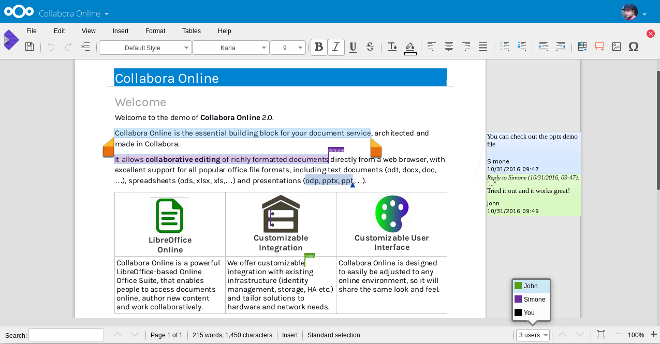

Vous connaissez tous « google doc » ou « office online » ?

Ce genre d’outils est très prisé en environnement scolaire pour travailler avec des élèves ! En effet un groupe d’élèves qui travaille sur le même exposé peut travailler ensemble sur le même document avec chacun son ordinateur. C’est très puissant.

Il faut savoir que ce genre d’outils (google apps ou office 365) est gratuit en établissement scolaire. Si vous êtes une entreprise, le prix va rapidement augmenter. Egalement, l’idée de ne pas vraiment savoir où sont stockées les données est problématique pour la confidentialité. En plus, il vous faut avoir une connexion internet correcte pour que l’ensemble soit utilisable. Bref, il semble important de proposer une alternative !

J’avais testé il y a maintenant 2 ans quelques outils de collaboration auto-hébergée. A l’époque les produits ne m’avaient pas convaincu plus que ça.

Je profite donc des vacances pour voir les évolutions et re-tester les différents outils open-source du marché.

- Libreoffice online
- Onlyoffice

J’ai donc remonté un petit [nextcloud](https://nextcloud.com/) rapide pour tester les deux solutions.

Le plus simple ensuite pour mettre en place les deux solutions c’est d’utiliser docker. C’est simple, rapide, efficace et on se fait pas chier pour les mise à jour.

Rien n’est stocké sur onlyoffice ou libreoffice online, l’application n’est qu’un éditeur, rien de plus !

Premier test; très concluant, très réactif ! Les deux solutions fonctionnent vraiment bien.

Onlyoffice semble embarquer pas mal de fonctionnalités le produit est très abouti, rien à envier a google doc ou à word online, voir même il est mieux ! Très très bonne surprise ! A tester rapidement !

Libreoffice online fonctionne très bien également ! Moins de fonctionnalités mais répond très bien a mes besoin ! Faire du doc, du calc, du ppt.

Onlyoffice dans sa version gratuite lui par contre a une limite à 20 utilisateurs simultanée. Au delà, il vous faudra prendre la [version payante.](https://www.onlyoffice.com/fr/enterprise-edition.aspx)

En soit, le logiciel est open source et le code ouvert, rien ne vous empêche d’aller modifier le code pour faire sauter l’avertissement… mais bien entendue, il ne faut pas le faire, il faut encourager financièrement le logiciel pour qu’il évolue et que les dev puissent vivre de leur travail ! Pour libreoffice online il y a égallement une limite (vous pouvez égallement recompiler pour faire sauter cette limite)

A savoir qu’une [réduction de -70% est proposée au école](https://www.onlyoffice.com/fr/education.aspx) pour l’offre auto-hébergée et gratuite pour l’offre cloud !

Bref, vous pouvez proposer a vos utilisateurs de reprendre la main sur leurs données ! A eux d’en décider !

 

### Subtilités technique rencontrée, et retour d’expérience.

Dans mes test j’ai installée les deux solution, onlyoffice et libreoffice online pour tester. Le tout couplée a un nextcloud

Dans les gros bonus; nextcloud est capable de monter des partage cifs pour les utilisateur! Gros avantage donc car on peut monter des partages windows (cifs) directement dans nextcloud, le plus fort dans l’histoire c’est que le tout est synchronisable avec le client lourd nextcloud sans pour autant être stockée sur le serveur nextcloud !

Egalement d’autre « external storage » comme google drive, Amazon, dropbox, ftp, sftp, webdav, openstack object … sont dispo !

Nextcloud peut aussi faire de la fédération si vous avez plusieurs établissement !

Attention par contre lorsque vous faite de l’édition collaborative avec ce genre de partage (car oui c’est possible) ! Il faut bien comprendre que si il y a écriture concurrentiel  entre le onlyoffice le libreoffice online, le client lourd et le fichier sur le partage cifs, c’est le dernier qui a parlée qui a raison ! Pas de versioning sur les external storage ! C’est une mécanique technique a comprendre mais ça va encore.

La ou cela peut devenir tordu c’est si vous faire de l’édition collaborative sur un partage cifs mais que les différents utilisateurs sont connectée au partage cifs avec un identifiant différent. (l’option identifiant et mot de passe de la session en cour lors de la configuration cifs).  

Du coup finalement chaque utilisateur ouvre son propre editeur au niveau du libreoffice online ou du onlyoffice et donc pas d’édition collaborative possible le dernier qui enregistre a raison et écrase les autre changement.

Pour contourner le problème j’ai créer un identifiant « next-cloud-share » pour les partage problématique et je connecte l’external storage en fournissant celui-ci.

Subtilités a comprendre donc …

### 

### Autre bonus du nextcloud:

Nextcloud emarque un store d’application. Dans les application interessante :

- Draw.io
- Client imap/smtp
- Client caldev
- Client cardev
- Outils d’apelle vidéo
- Liste de Tache
- Outils d’organisation …

Bref très bon produit !
