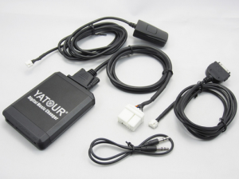

En vacances, du coup, je fais un petit article non informatique.

Il n’y a pas longtemps j’ai changé de voiture. A mon grand regret pas de bluetooth, pas d’auxiliaire, pas d’USB, par de carte SD. Bref, FM et CD uniquement. Par contre très bonne qualité de son.

J’ai commencé à voir pour changer l’autoradio mais cela était compliqué (ordinateur de bord relié) bref un merdier. Et puis cela aurait gâché le design

Je pars donc à la pêche et je vous fais un retour:

**1er Test : Le Belkin CarAudio Connect FM**

En gros l’appareil fait :  

Téléphone –> Belkin CarAudio Connect FM –> Réception en FM sur l’autoradio  

C’est pas mal, mais bon c’est la qualité FM… Pas génial  

Et puis il suffit que vous rouliez beaucoup pour que la fréquence choisi ne soit plus dispo. Bref j’ai abandonné l’idée.

Par contre, une autre solution existe si vous avez l’auxiliaire sur votre autoradio:  

Le Belkin CarAudio Connect AUX Bluetooth

C’est le même fonctionnement que le Belkin CarAudio Connect FM mais en auxiliaire, donc aucun problème de fréquence ou de qualité. C’est pas cher, génial mais … J’ai pas d’auxiliaire sur mon autoradio …

Du coup j’ai testé

**Le Kit Parrot :**

Le kit parrot c’est bien ! Ça a l’avantage de couper tout le son lors d’un appelle (ce qui n’est pas le cas des deux solution au dessus), par exemple, ça coupe la radio pour faire sonner votre téléphone.  

Comment ça marche dis donc ?  

En fait le kit parrot remplace complètement l’autoradio lors de son utilisation (électroniquement parlent) il embarque un ampli.

Du coup l’un des soucis du parrot, c’est que sans adaptateur supplémentaire, on perd souvent les commandes au volant (même le volume). L’autre soucis c’est que comme le parrot utilise son propre ampli, la qualité et/ou la puissance peuvent être altéré.

J’ai fini par trouver autre chose.

 **Le YATOUR:**  

La yatour est un système malin, mais qui n’est pas fonctionnel sur toutes les voitures.

Il utilise la prise chargeur cd à l’arrière de l’autoradio. (une sorte d’auxiliaire finalement).

  

Du coup ce boîtier fait auxiliaire, carte SD, et USB. Et en option supplémentaires, iPod et bluetooth.

Un truc con, toutes les commandes au volant fonctionnent (touche suivant, volume) sauf pour le Bluetooth, le bouton suivant pour les titre musicaux ne fonctionne pas. Mais je me demande si je ne me suis pas trompé d’adaptateur Bluetooth. Un petit bouton pour décrocher doit être installée. Pour le reste j’ai tout caché dans la boite à gant.

Le soucis du yatour (à l’inverse du parot) vous serez obligé de basculer sur cd lors d’un appel.  Le deuxième gros soucis s’est qu’il faut que le yatour soit compatible avec votre voiture …

**A vous de faire votre choix !**
