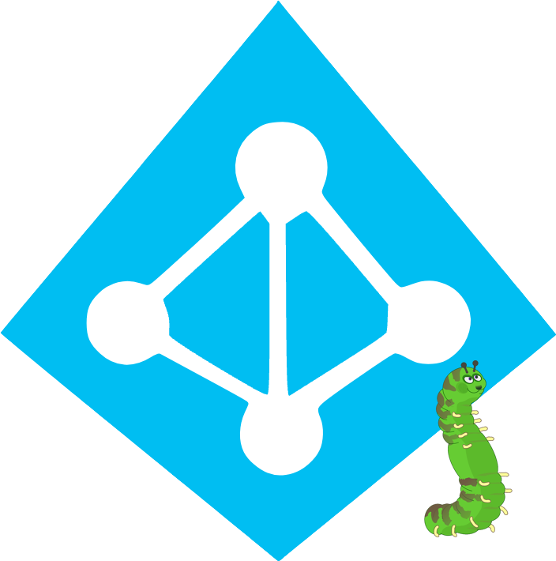

Hello everyone, another quick post,

In my previous article I present to you an [azure ad connect samba4](https://github.com/sfonteneau/AzureADConnect_Samba4) script written in python and which works under linux to synchronize your user/group/device to azure ad.

I also just made a new project almost identical to the first called [AzureADConnect\_Ldap](https://github.com/sfonteneau/AzureADConnect_Ldap) which allows users and groups to be synchronized from openldap (or other similar ldap solution) to azure ad. Convenient for organizations without active directory (Microsoft or samba4)

Attention ! For password synchronization to work, your openldap must have the HASHNT (NTLM HASH) of the user.

The attribute is often present if you have the samba3 schema in your openldap and present in the “sambaNTPassword” attribute

There are many openldap implementations, the script may need some modifications to suit your needs

Have fun !
