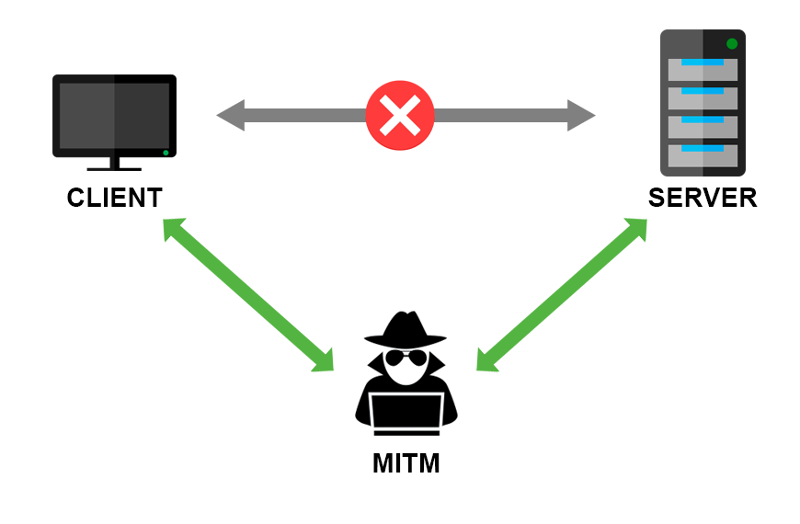

Je constate lors de mes divers et nombreux déplacement que le filtrage mitm par les firewall est quelque chose de plus en plus répandu en entreprise et collectivité. J’ai donc décidé d’en parler !

## Historique

Revenons a la base, pourquoi l’https a été inventé ?  

Dans les entreprise, la nécessité de chiffrer le flux pour éviter qu’un pirate ne puisse récupérer des information sensible devient une nécessité, notamment pour les banques. Les sites de vente en ligne …

Principe de fonctionnement : Le navigateur est capable de vérifier qu’il discute avec le bon serveur grâce au certificat du site web. La connexion est chiffrée et donc illisible par un attaquent positionner sur un routeur par exemple.  Un petite révolution ! On peu maintenant être certain de discuter avec le bon serveur de manière chiffré !

## C’est quoi le filtrage mitm ?

Souvent, c’est le firewall de votre entreprise qui va se comporter comme un pirate et analyser tous le trafic pour bloquer ou autoriser la connexion.

### Comment ça marche ?

Le principe de fonctionnement est du coup assez simple pour analyser le contenu https. On installe le certificat du fwall dans les différent bundle de certificat des clients (store windows, firefox, logiciel…)  

Ensuite lors du surf, le fwall va chiffrer la connexion avec sa clé et va ainsi pouvoir analyser tous le trafic … (mot de passe, mail, image tous y passe)

## Que doit on en penser ?

Je ne blâme pas le principe…  En revanche il faut être clair avec ses utilisateurs en leurs indiquant la pratique !

En pratiquant le mitm il faut donc être rigoureux… l’appareil qui fait le filtrage est souvent le fwall, et l’ironie veut que c’est l’appareil qui est directement en frontale sur internet …

Vous vous devez donc (plus particulièrement que d’habitude) de vérifier que votre appareil est à jours, la moindre faille de sécu est critique car le pirate peut déchiffrer le flux https.

De la même manière, si vous remplacez l’appareil et que vous jetez l’ancien. Vous devez vous assurer que la clé privé a bien été supprimé de l’ancien appareil. (cela parait évident mais bon …)

Je constate dans trop de cas que l’option est activée sans vraiment que l’administrateur prenne conscience qu’il est en train de prendre une responsabilité vis à vis de ses utilisateurs.

De la même manière, vous ne devez pas demander a vos utilisateurs d’installer le certificat sur leur poste personnel (pour du wifi invité par exemple)…

Cela m’est déjà arrivé que l’ont me demande d’installer ce genre de certificat dans mon navigateur lors de déplacement. L’admin réseau semblant alors étonné que cela soit un non catégorique de ma part…

## Conclusion

Le but n’est pas de blâmer mais plus d’ouvrir un débat sur cette pratique qui se généralise … Si vous êtes utilisateurs je vous invite a en discuter a votre adminsys…
