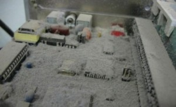
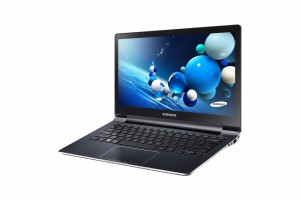

Je cherchais un laptop fanless (comprendre sans ventilateurs).  

Avoir un fanless a certains avantages :  

– Pas de bruit et pas besoin de passer la soufflette dedans tous les 4 matins.  

– Bah oui, pas de ventilos, pas de poussière…

Je voulais un truc plutôt fin. J’ai donc commencé mes recherches :

Le nouveau MacBook (si si j’y ai vraiment songé), mais techniquement tout passe par le nouveau port USB-C (c’est le seul et unique port, bref c’est pas pratique du tout).

Du coup pour une simple clé USB, vous avez besoin de l’adaptateur…  

Vrai pas pratique…  Surtout quand le prix est quand même de 1449€ pour le modèle de départ équipé 256 Go de stockage…

Bref passons à la suite…

Je suis ensuite tombé sur le Samsung ATIV Book 9 (2015) :  

4 Go de RAM et 128 Go de SSD avec un processeur Intel Core M 0.9 GHz  

Au niveau du processeur, si on veut du fanless faut pas cadencer trop haut.  

Il avait l’air sympa mais il était quand même à 1200 $

Et ensuite je suis tombé là-dessus :

Le ASUS ZenBook UX305.  

4 Go de RAM et 128 Go de SSD avec un processeur Intel Ccre M 0.8 GHz 629€  

Bon du coup je vais pas vous faire un dessin j’ai commandé celui la !

A l’ouverture du colis, découverte :

Tout en aluminium, très fin et très léger.  

– 3 prises USB  

– 1 prise casque/micro  

– 1 prise micro HDMI  

– Un lecteur carte slot carte SD  

– Une prise alimentation  

– Micro et webcam intégrés  

– Embarque le Bluetooth 4.0

Démarrage du PC –> Présence de Windows 8.1… Je supporte vraiment pas les tuiles de Modern UI…

————————————————-  

2H de désactivation UEFI et secure boot…  

*Formatage en cours pour une Fedora 21 Workstation…*  

————————————————-

Une fois démarré, le ZenBook tient ses promesses, à 30% de luminosité, le PC annonce 10H d’autonomie.

La qualité de l’écran est à mon goût irréprochable.  

C’est une dalle mate, c’est pratique pour travailler.

Deux petits haut-parleurs sont situés sous la machine, le rendu n’est pas très fort mais la qualité est là. Je préfère ça que l’inverse…

En revanche quelques points négatifs :  

– Le clavier est bruyant (encore plus flagrant du fait qu’il n’y a pas le bruit de souffle des ventilos)  

– Le touchpad est vraiment pas top (on finit par s’y faire mais bon…)  

– Carte Wi-Fi moins puissante (l’antenne ne doit pas être située dans l’écran)  

– Les traces de doigts viennent gâcher le plaisir des yeux.  

– RAM soudé à la carte mère… Pas cool du tout !  

– Chauffe pas mal dessous (normal pas de ventilos)

Autre truc merdique, pour refroidir le PC, ASUS a fait une ouverture de l’écran qui rehausse le dessous du PC ; le problème c’est que ça raye le PC

C’est un peu con…

Bon malgré tous ces quelques défauts, pour le moment j’en suis très satisfait !
