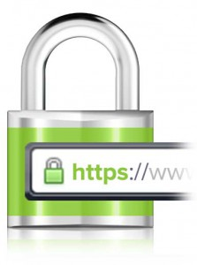

I’m writing what I know (or what I think I know).  
If you spot a mistake, **please correct me in the comments**.

---

A quick post because Let’s Encrypt has launched a public beta!

And it works really well!! And it’s free!

A quick reminder: HTTPS mainly encrypts the connection between the server and the user.

---

## Self‑signed certificates

You can generate [self‑signed certificates](http://www.linux-france.org/prj/edu/archinet/systeme/ch24s03.html) today, but the browser will show a warning to the user.

You can also buy a certificate from a CA, but it costs money (and you generally need a certificate per domain name).

Let’s Encrypt changes the game by providing free, automated certificates. It makes it much easier to deploy HTTPS everywhere — and that’s great news for users.
