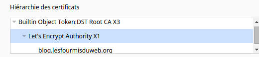
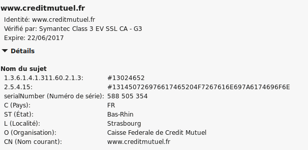
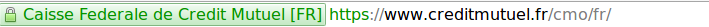

J’écris ce que je sais (ou ce que je pense savoir).  

Si vous voyez une erreur, **n’hésitez pas a me corriger dans les** **commentaires**

——–

Petit article rapide car Let’s encrypt est sortie en beta public !  

Et ça marche super bien !! Et c’est gratuit !

Petit rappel le https sert principalement pour l’utilisateur a chiffrer la connexion entre le serveur et l’utilisateur.  

—  

**Certificat Auto-signé :**  

Il est possible aujourd’hui de générer aujourd’hui des [certificats auto-signé](http://www.linux-france.org/prj/edu/archinet/systeme/ch24s03.html) mais il générerons une erreur car il ne sont pas signée avec une autorité de certification reconnue par les navigateurs. Ils vont provoquer  une erreur de ce style : https://erreur.lesfourmisduweb.org

Pour ne générer aucune erreur, il faut que le certificat soit signée par l’un des ça root installée sur la machine. Il faudra donc installer sur la machine cliente le ça root qui a permis de générer le cerficat utilisée sur le serveur web

Ce qui devient vite problématique car on ne peut pas demander a tout nos utilisateur d’installer le certificat le ça root sur leur machine.

Mais heureusement, les navigateurs embarque des ça root de confiance.

Firefox embarque par exemple :https://mozillacaprogram.secure.force.com/CA/IncludedCACertificateReport

Let’s encrypt est donc une autorités de certification valide et reconnue dans la plupart des navigateurs. Dans la liste de firefox, le ça root correspond à ceci

| IdenTrust | Digital Signature Trust Co. |  | DST Root CA X3 |

Car il y a une Hiérarchie et si j’ai bien compris Le’ts encrypt peux signer des certificats car IdenTrust a signée le certificat de let’s encrypt qui peux signer mon propre certificat.

Revenons plus simple !

Petit rappel pour les type certificats qui existe:

- Le SSL pour la verification du serveur :  

Ce certificat permet pour l’utilisateur final d’être certain que le serveur qu’il contacte est bien celui qu’il prêtent être. Cela permet d’éviter les attaque de type man in the middle.

 

- Le SSL pour la verification du serveur ET de l’organisation :  

Celui permet de vérifier l’organisme contacté est bien le bon. Par exemple pour le crédit mutuel :  

  

Le champ organisation est remplie. Ce qui signifie qu’il y a bien eu vérification (papier) que l’organisation a qui a été délivrer le certificat est bien celle qu’elle prétend être.

 

- Certificats X.509 étendus :  

Bon la j’ai encore du mal a comprendre mais *« il permettent l’affichage d’un fond vert (indiquant ainsi un site de confiance garantie). »*Comme ceci:  

Visiblement les Contrôle et les exigence sont plus renforcer pour obtenir ce type de certificat. Tous les site de banque possède ce type de certificat. Prenez donc l’habitude de vérifier que cette barre verte est présente si lorsque vous accédez a des site sensible.

 

- Il y a ensuite les wildcard :  

Il permet de protéger un nom de domaine et tous les sous-domaines existants ou à créer de ce domaine. Par exemple *.lesfourmisduweb.org  

Très pratique lorsque que l’on a de nombreux sous domaine a sécuriser?  

Il peuvent ensuite vérifier l’organisation ou non et être étendus ou non.

 

- Et il  y a ensuite les multi-site:  

Un seul certificat peu donc sécuriser plusieurs site de plusieurs nom de domaine différent.  

Cette solution se base sur le champ subjectAltName.  

Il peuvent ensuite vérifier l’organisation ou non et être étendus ou non.

Ensuite les certificats peuvent fournir une garantie financière en cas de « problème » pour son possesseur.

**Donc que fournis donc maintenant let’s encrypt le nouvelle arrivant ?**  

Il fournis un ou des certificats multi-site pour la vérification  du serveur mais sans champ organisation ni vérification étendue sans garantie financière. A vous donc de ne pas vous faire pirater votre zone dns publique !

Pour le moment c’est 5 certificats par domaine tous les 7 jours. C’est quand même génial ! Et pour le moment c’est une version beta !

Il y avait déjà startssl qui permettait cela. On peut les saluer et les remercier pour cela! Mais malheureusement, avec startssl, nous ne pouvions valider qu’un domaine et un sous-domaine !

- Lesfourmisduweb.org
- sousdom.lesfourmisduweb.org

Comment Let’s Encrypt vérifie t’il que vous êtes bien bien le propriétaire du domaine ?

Lorsque vous générer votre certificat vous indiquez Le chemin /var/www/ par exemple ou /var/www/siten2/

La c’est quelque chose qui me dépasse mais pour expliquer grossièrement:  

Let’s encrypt va y deposer un dossier  «.well-known » a la racine sur serveur du chemin que vous avez indiquer et va indiquer aux serveurs de let’s encrypte les nom de domaine a valider. Let’s encrypte vérifie donc via ce dossier que le serveur qui fait la demande pour un certificat est bien celui qui correspond au nom dns enregistrée sur les serveur publique. Et si tout est conforme, accepter de vous délivrer un certificat signé par une autorités de certification reconnue  

K3nny a fait un article ici pour un petit tuto de comment s’en servir :

[ICI](https://www.k3nny.fr/?p=1167)

Petit ajoute pas rapport a la doc de k3nny Ajouter:  

–standalone-supported-challenges tls-sni-01  

Pour vérifier.well-known sur l’https au lieu de l’http

Vous pouvez ajouter plusieurs adresse pour un même certificat avec :  

-d wapt.lesfourmisduweb.org -d wapt.sono-syrius.fr  …  …

Evidemment il faudra que tout les enregistrements dns tombe au bon endroit,sur la bonne conf apache et le bon dossier

 

Bon test
