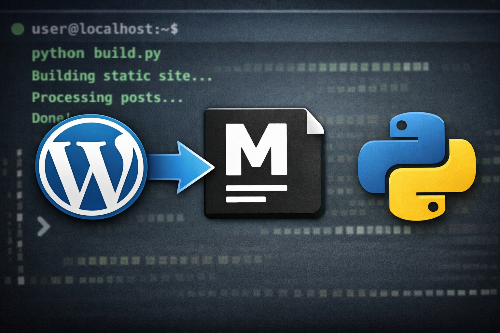

For a long time, my blog ran on **WordPress**. It works great, but I no longer needed the whole “machine”: database, plugins, updates, attack surface, etc.

I wanted something that is:

- **easy to maintain**
- **fast to serve**
- **easy to version**
- **portable** (just a folder to copy, that’s it)

So I migrated to a **static blog**, generated from **Markdown files**.

## How it works

Each post is a `.md` file with YAML front matter:

```yaml
---
title: "My title"
date: "YYYY-MM-DD"
slug: "my-slug"
lang: "en"
key: "my-identifier"
---
```

The content is written in **Markdown** (local images are supported too).  
And a simple **Python script** generates the final HTML site:

- a home page listing posts (newest to oldest)
- one page per post, directly at the **slug** URL (`/<slug>/`)
- translation support (e.g. `fr.md` / `en.md`) when available
- a clean design, with a **dark/light mode** toggle

## Why I like this approach

- No database
- No backend to maintain
- “Dumb” deployment: serve the `dist/` folder and you’re done
- Everything is versioned with Git (posts, assets, config, templates…)

## Source code

If this can help others, I published the script and project structure on my GitHub.

👉 It’s all here: [GitHub](https://github.com/sfonteneau/blog)

