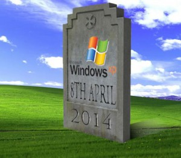

Bonjour

Petite annonce pour vous annoncer la sortie de WAPT 1.2.

Quelques nouvelles fonctionnalités, plus stable…

Voir les notes de version ici :  

<http://dev.tranquil.it/wiki/WAPT/ReleaseNotes>

Autres infos à propos de mon dépôt :

<http://wapt.lesfourmisduweb.org/>

Je vais « essayer » d’arrêter de gérer les version XP  

Adobe Reader DC, FileZilla, et bientôt Google Chrome ne vont plus gérer les mise à jour pour Windows XP.

Aussi :  

Tous les paquets mis à disposition dans mon dépôt ne conservent pas les versions précédentes du logiciel.

J’indique également que tous **les paquets de mon dépôt sont fournis sans garantie de fonctionnement**. Ils doivent absolument être testés avant d’être déployés.
