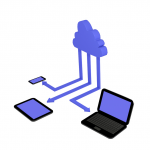

Encore un petit article pour un petit souci que j’ai rencontrée.  

dans mon établissement où nous avons montée un owncloud. Le owncloud est très pratique pour les enseignants et élèves à l’extérieur. Avec le client installé à l’extérieur sur le poste personnel des enseignants c’est parfait.  

En revanche, en interne, c’est plus compliqué. J’ai d’abord pensé à faire un partage samba pour ensuite monter un lecteur réseau sur la session, mais au niveau des droits entre samba et owncloud c’est un peu plus compliqué.

Une solution plus simple s’offre donc à moi. Le webdav !  

Sous windows, une fois montée, le webdav se comporte comme un lecteur réseau. Comme c’est un standard,  il est également dispo sur de nombreux appareils mobiles.

Comment faire pour faire fonctionner le webdav sous windows ?  

Avant toute chose, plutôt que de modifier la clé  » **BasicAuthLevel** » dans windows comme le propose certain site, je vous propose de faire un certificat let’s encrypt. C’est gratuit et cela vous assure au moins la sécurités.

### **Owncloud – Windows – ServerName**

Ensuite, assurez-vous que lorsque vous tapez https://ipdeowncloud que vous arrivez bien sur la page d’owncloud. En effet, chez moi, j’ai plusieurs sites Web sur ma dmz. J’ai aide.lesfourmisduweb.org et cloud.lesfourmisduweb.org. Je gère donc les deux sites avec le **ServerName** et le **ServerAlias** dans les deux fichiers **aide.conf** et **cloud.conf** :

Exemples:

ServerName cloud.lesfourmisduweb.org  

ServerAlias owncloud.lesfourmisduweb.org

Lorsque le site demandée dans l’url de l’utilisateur est inconnue, apache va prendre le premier site disponible par ordre alphabétique dans:  

/etc/apache2/sites-enabled/

En l’occurrence, lorsque je tape mon ip, je tombe donc du coup sur le site aide.lesfourmisduweb.org

Pour en revenir au webdav owncloud sous windows, celui-ci ne supporte pas le « Server Name Indication ». Comme indiquée sur le site d’owncloud:

> *The Windows WebDAV Client might not support Server Name Indication (SNI) on encrypted connections. If you encounter an error mounting an SSL-encrypted ownCloud instance, contact your provider about assigning a dedicated IP address for your SSL-based server.*
> 
> 
> 

Du coup le webdav échoue  

Pour résoudre le problème il suffit de renommer cloud.conf en aaacloud.conf

D’où l’intérêt de faire en sorte que https://ipdeowncloud arrive bien sur le site owncloud.

### Connexion du lecteur réseau:

Une fois tous ces prérequis effectués, dans un script windows vous pouvez faire un :

net use z: « https://cloud.lesfourmisduweb.org/remote.php/webdav/ » /savecred /persistent:yes

Voila ! Votre webdav est fonctionnel.
