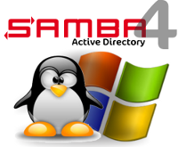

In my previous post I talked about the outrageous price of Microsoft licenses: a simple virtualized Active Directory can cost a lot.

But since Samba 4, reliable alternatives exist — with great features.

Here is my feedback on Samba 4.

I use it with two virtual servers:
- One Active Directory server (LDAP)
- One file server

Samba 4 includes the main Active Directory tools:
GPO, ACL, DNS

And it keeps Samba 3 advantages too:
- pre‑exec / post‑exec (run scripts before/after share access)
- hide files (hide files on a share)
- browseable (hide a share without adding `$` like on Windows shares)
- share access control by IP address
- use `%U` (username) and `%G` (primary group) variables in share names and paths
- etc.

The AD/DNS/GPO part can be managed via `samba-tool` or even better: Microsoft Management Consoles.

See the general idea here:
[iframe src="http://www.youtube.com/embed/mDWIAGCJe2E" width="100%" height="500"]

Windows‑like file sharing is also available.

The applications I connect to my Samba 4 today are unable to tell the difference between a Windows AD and Samba 4.

My recommendation is still to compile your own Samba 4, but SerNet also offers an ISO that’s already packaged (handy for beginners or for quick tests).

Companies like Tranquil IT provide training and help with migrations.

My tutorial:
http://wiki.lesfourmisduweb.org/index.php/Serveur_Samba_4
