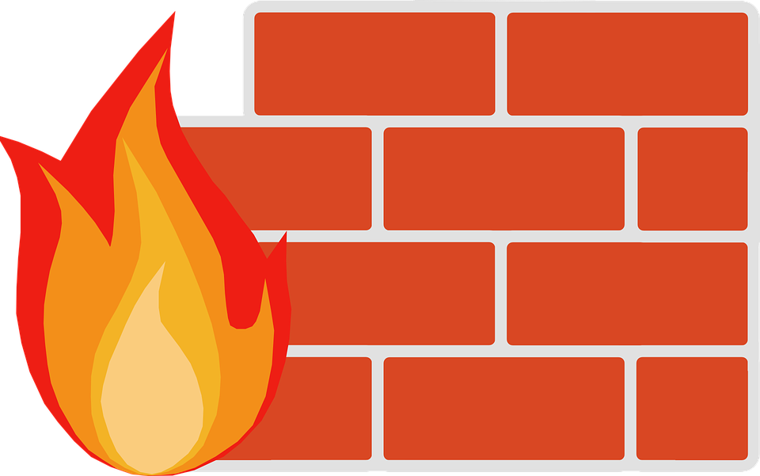

A quick post to introduce a simple and effective solution.

In general we all agree iptables is reliable and powerful… but the syntax can be painful.

I discovered **Shorewall** at my new job at Tranquil IT.

Shorewall is a layer on top of iptables that simplifies configuration.

I increasingly like no‑frills solutions: no web interface, everything is just a few config files that are easy to back up.

With “all‑in‑one” firewall distros like pfSense (I’m not bashing it), you don’t always know what’s happening under the hood — not great when you need to troubleshoot.

Another advantage of Linux‑based solutions is that you’re not tied to specific hardware (SonicWall, Cisco, etc.) and you avoid licenses.

Give it a try — I think it’s worth it!
