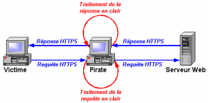

First, you need to understand the difference between browsing with a declared proxy and browsing without a proxy.

### Without a proxy

The computer connects directly to the server hosting the requested website. It resolves the IP via DNS and then connects through the gateway.

### With a proxy configured in the browser

It’s different: the computer does **not** directly contact the destination server. The browser sees the proxy configuration and says:

- “Hey proxy server 172.21.254.254:3128, can you fetch toto.fr for me and give me the web page?”

The proxy replies:
- “OK, here is the page you requested.”

The proxy is in the middle:

## Transparent proxy

Squid has a transparent proxy mode: it lets Squid sit in place of the gateway, so the computer *thinks* it talks directly to the website server.

This works fine for HTTP browsing, but it does **not** work well for HTTPS.

Why?

HTTPS encrypts and secures connections. It can verify that the connection hasn’t been spoofed (domain name verification, certificates, trusted root CA validation). The whole point is to protect the connection.

Squid can intercept SSL in transparent mode, but it requires pre‑installing a custom root CA. Websites don’t like that, because it means decrypting HTTPS traffic. Also, some sites rely on SNI:
http://www.rackspace.com/knowledge_center/article/serving-secure-sites-with-sni-on-apache

This is basically a man‑in‑the‑middle approach:

Solutions like ALCASAR exist (http://www.alcasar.net/fr/telechargement?func=select&id=11), but I’m not a fan. They filter using DNS requests (dnsmasq) combined with IP requests (iptables), Squid and DansGuardian for HTTP.

Some transparent filtering approaches (e.g. SonicWALL) work similarly.

## The solution I use

The cleanest solution I’ve found is to **declare the proxy**. When a user isn’t configured to use the proxy, they get redirected to a page explaining how to configure their browser or phone.

More in a next post… with a more reliable solution.
