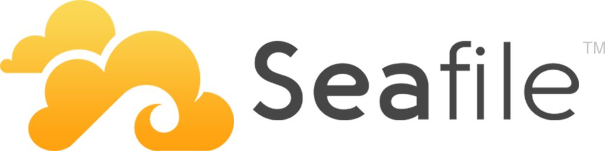

Recently I talked about Nextcloud. Today: **Seafile**.

Seafile has a different vision. Where Nextcloud provides a plugin system and aims to be versatile, Seafile focuses on the core: **file hosting and synchronization**.

Seafile’s main difference is how it stores data. As explained in this document:
https://manual.seafile.com/develop/data_model.html  
its model is close to Git.

Seafile stores data in blocks. This is very efficient: for example, if you edit a 50 MB LibreOffice document, the whole file doesn’t need to be uploaded again — only the changed blocks are synced. This makes client/server sync faster and optimizes server storage for versioning.

Seafile also has the “Virtual Drive Client”:
https://www.seafile.com/en/help/drive_client/

It creates a virtual drive on the client: you see the tree and files, but the file content is downloaded only when you open it. Recently opened files are cached locally and marked with a green check mark. This avoids downloading entire folders.

Seafile also works well with Collabora and OnlyOffice.

Unlike Nextcloud, you can’t easily connect it to external storage like a CIFS file server: Seafile is meant to replace it rather than sit on top of it.

WebDAV is available too.

In short, Seafile and Nextcloud are different solutions designed with different priorities. On performance (sync client side), Seafile wins. On interoperability and web interface, Nextcloud wins.

Choose what fits your needs 😀
