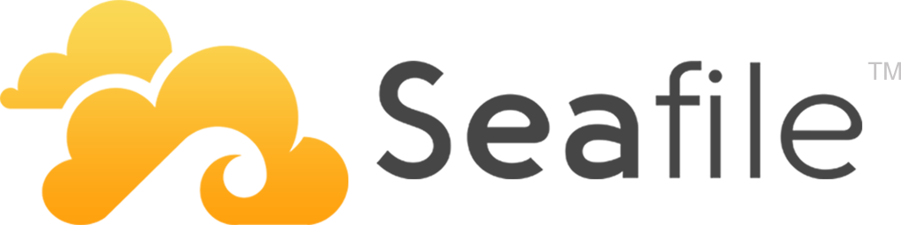

Récemment, je vous ai parlé de nextcloud. Aujourd’hui je vous parle de seafiles

Seafile fonctionne différemment, sa vision est différente. Là où nextcloud va proposer un system de plugin et essayer d’être le plus polyvalent possible, Seafile va se concentrer sur la partie la plus importante: l’hébergement de fichier.

Seafile se différencie par sa façon dont sont stockée les données. Comme l’indique [ce document](https://manual.seafile.com/develop/data_model.html), le fonctionnement se rapproche du fonctionnement GIT

Seafile stock en block, l’avantage de ce type de fonctionnement, c’est que c’est très efficace. En effet par exemple sur un Document libreoffice de 50mo, si ce document est édité, tous le document se sera pas uploadé. Seafile se débrouillera avec les bloc pour ne synchroniser que la différence. Ce mode de fonctionnement a l’avantage de rendre la synchronisation plus rapide entre le client et le serveur mais également d’optimiser la place côter serveur pour la partie versionning.

Seafile a aussi un avantage avec le « Virtual Drive Clients »

Le [Virtual Drive Client](https://www.seafile.com/en/help/drive_client/) permet d’installer sur le client un disque dur virtuel seafile sur son ordinateur.

L’arborescence apparaît ainsi que les fichiers.  Le contenu du fichier sera téléchargé lorsque vous ouvrirez un fichier. Le fichier récemment ouvert sera mis en cache sur votre disque local. Tous les fichiers mis en cache seront marqués d’une coche verte. Cela évite de télécharger tout un dossier.

Seafile gère également très bien Collabora et onlyoffice

Vous ne pourrez pas en revanche connecter celui-ci a un storage externe a la manière de nextcloud avec un serveur de fichiers de cifs. Seafile est plus dans l’optique de remplacer celui-ci.

Le webdav est dispo !

Bref, Seafile et nextcloud sont deux solutions différentes. On sent bien que les deux solution on été pensées de manière différente. Au niveau performance (coter client de synchronisation) seafile l’emporte. Au niveau interopérabilité et interface web, nextcloud l’emporte.

Bref, faire votre choix 😀
