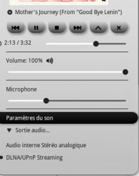

If, like me, you use a Linux desktop, it can be handy to send your audio to your TV.

In my case it’s a Samsung Smart TV, so it supports AllShare.

After some searching I found **Rygel**.

Rygel is a UPnP/DLNA multimedia solution.

DLNA is more standard than AirPlay, which is an advantage.

How it works:
You can select where to send the stream.

Don’t expect instant audio though: there’s about 4 seconds of latency between playback and what you hear.

If you’re interested, follow these tutorials:
http://community.linuxmint.com/tutorial/view/1506  
https://linuxsysadm.wordpress.com/2014/02/22/streaming-pulseaudio-on-a-samsung-smarttv/

No wiki tutorial this time 🙂

Simon
