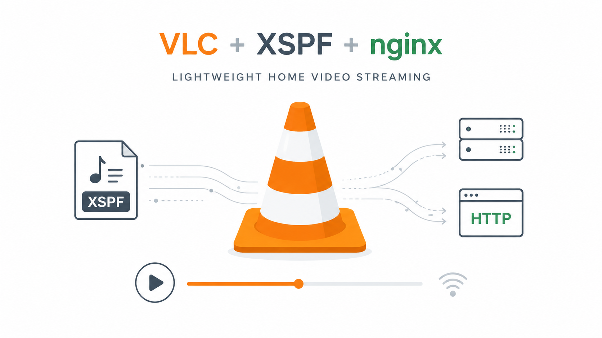

Hi everyone,

I have a small personal server that is definitely not a powerhouse: **0.8 GHz CPU and 4 GB of RAM**.

At some point, I thought it would be useful to also use it to watch the videos stored on it.

The problem is that, with hardware like this, big media server solutions with transcoding, web interfaces and all the extra machinery were not really an option.

Then I realized something very simple: I already had the video player.

**VLC.**

I just needed an easy way to give it access to my videos.

That is when I discovered **XSPF**, an XML playlist format supported by VLC.

So I wrote a small Python script, **[generate_xspf](https://github.com/sfonteneau/generate_xspf)**, which scans my folders and automatically generates a playlist containing the URLs of my videos.

Basically:

```text
Videos → generate_xspf → XSPF playlist → VLC
```

And to serve the files, I simply use **nginx**.

The nice part is that I can give VLC the HTTP URL of the XSPF file directly.

In VLC, I just open **“Open Network Stream”** and paste a URL such as:

```text
https://my-server/vlc.xspf
```

VLC downloads the playlist and immediately displays the available videos.

## And actually… that is enough

There is no transcoding on the server.

nginx serves the video file directly and **VLC downloads it progressively while it is playing**.

There is no need to download the entire movie before starting to watch it.

And if I jump straight to the middle of a movie, VLC uses HTTP `Range` requests to ask nginx only for the part of the file it needs.

So even with a very small server, playback stays smooth and the CPU has almost nothing to do.

That is what I like about this setup: the server does almost nothing.

It serves files.

And VLC does the rest.

## A client available everywhere

Another advantage is that **VLC is available on almost every platform**.

I can use the same XSPF URL from my computer or my phone, watch the video directly, or cast it to a **Chromecast** from my phone.

Of course, because there is no transcoding, the file format and codecs have to be supported directly by the device.

## Not fancy, but extremely effective

Let’s be clear: this is not Netflix.

No cover art, no big interface, no recommendations, no on-the-fly transcoding.

Just:

**nginx, an XSPF playlist and VLC.**

And yet, on my **0.8 GHz** server, it works very well.

I wrote this small tool quite a while ago, and recently noticed that people are still interested in it.

When I show the setup to people, the reaction is often the same:

**“Oh… that’s actually brilliant.”**

And that is exactly why I like this solution.

It is not sophisticated.

It is just simple, lightweight and effective.
