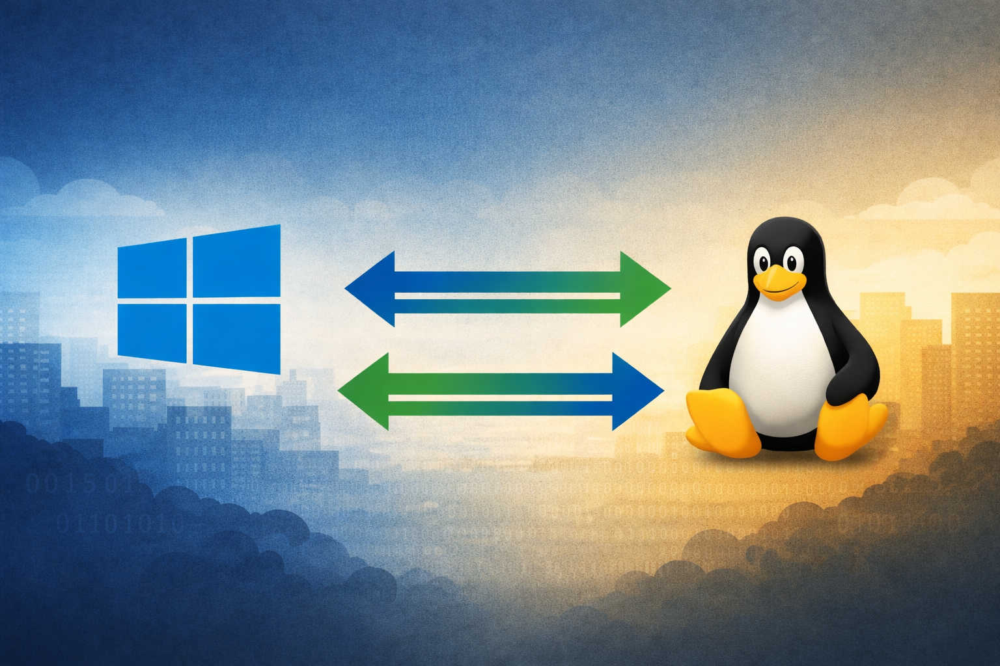

# Windows to Linux in the Enterprise: building the “sysadmin bundle”

Migrating from Windows to Linux in a company is not the same thing as what a home user does on a personal laptop.

At home, you install a Linux distro, you are the admin, you have no directory services, no fleet to manage, no policies to enforce, no compliance constraints, and most of your work happens in a browser anyway.

In an enterprise, you don’t throw an existing ecosystem in the trash overnight. You need a smooth transition. That means **interoperable protocols** and a **progressive migration path**.

## No “big bang”
The “big bang” method almost never works. It’s the best way to break something critical and lose trust internally. A realistic migration is a **coexistence period** where Windows and Linux desktops run side-by-side, and services keep working for both.

That coexistence is only possible if what you deploy is based on **standards and interoperable protocols** (Linux ↔ Windows), so everything continues to function even when you must keep some Windows machines (because a business application only runs there).

## Microsoft is (too) well integrated
It’s also important to admit something: Microsoft is extremely well integrated.

Windows is a “turnkey” desktop OS for enterprises, with a lot of sysadmin building blocks designed to work together out of the box: identity, policies, device management patterns, encryption workflows, certificate enrollment, remote access, and so on.

On Linux, that **“sysadmin bundle”** exists, but it is not delivered as one single coherent package. It’s something you have to **assemble**: pick the bricks, make them work together, and make the result manageable at scale.

That is the real topic of this article.

## Not about servers
This article is **not** about the server side.

Today, building a server environment entirely on Linux is often the easiest part. The real challenge is the **desktop side**: managing endpoints, users, authentication, security controls, enterprise workflows, and long-term operations.

## Not about choosing a distro or a desktop
I’m also **not** focusing on distro choice or desktop environment selection. That debate is mostly sterile and doesn’t solve the core problem.

The hard part is not “GNOME vs KDE” or “distro X vs distro Y”.

The hard part is: **how do we replace the Windows enterprise admin ecosystem with something solid on Linux**, while staying interoperable during the transition?

## A growing list of enterprise “sysadmin” use-cases
I started listing the main “sysadmin-side” use-cases that need an interoperable migration path on GitHub. The list is a work in progress:

- some use-cases already have solutions (built or ready to use),
- some have partial solutions (still being built),
- and some still don’t have a clear equivalent.

Repository here:  
[https://github.com/sfonteneau/windows-to-linux](https://github.com/sfonteneau/windows-to-linux)

## Interoperability: protocols first
Interoperability is relative.

Some things can’t be “interoperable by design” because they are vendor-specific concepts. A good example is **AppLocker**: it’s not a protocol, it’s a Windows feature. In that case, the goal is to find an **equivalent** on Linux.

But the **protocols** and integration points should remain interoperable wherever possible (identity, authentication, file sharing, certificate workflows, remote access…), because that’s what makes a progressive migration possible and avoids breaking mixed environments.

## What’s next
Soon I’ll publish a similar “Windows → Linux” list for the **server** side — which should be simpler.

For now, the focus is the desktop migration and the missing “bundle” that needs to be built for Linux in enterprise environments.

